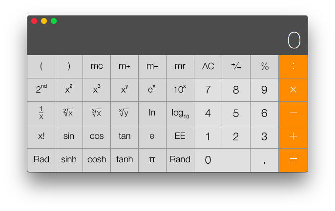

# Responsive Calculator

## Description
A calculator built with HTML, CSS, and JavaScript

## Objectives

### Learning Objectives

After completing this assignment, you should...

- Understand how to include JavaScript in your page.
- Understand how to use JavaScript variables.
- Understand the syntax and meaning of a function declaration.
- Be familiar with, though not necessarily understand completely, how to respond
  to user interaction using functions and event listeners.
- Understand how to do basic arithmetic in JavaScript.

### Performance Objectives

After completing this assignment, you be able to...

- Write a JavaScript file that is loaded in a web page
- Write a JavaScript function that is executed on a button click.

## Details

### Deliverables

* A repo containing at least:
  * `main.js`
  * `index.html`
  * `main.scss`

### Requirements

## Normal Mode
Write a calculator using HTML, CSS, and JavaScript.  It should function exactly
like Calculator.app on your computer, except that it should alert the
calculation instead of displaying it on a screen.

The basic functionality should include clear (C), add (+), subtract (-),
multiply (\*), and divide (/).


### Tasks

#### Getting Started
  * [ ] Create a new issue with tasks and estimates
  * [ ] Create a new repository
  * [ ] Create a new branch based on `master` named `<initials>-develop`
  * [ ] Create and commit `index.html` and `scss/main.scss`
  * [ ] Push and open a Pull Request to `master`
  * [ ] Install Bourbon and Neat
  * [ ] HTML Boilerplate
  * [ ] Add structure using HTML

#### Layout
  * [ ] Add all of the buttons.
  * [ ] Style the buttons to appear on a grid.
  * [ ] Style the buttons, either copying exactly the Calculator.app style, or
    exercising your creativity to create a different style if you so choose.
  * [ ] Make the buttons appear 3D and use CSS transitions to "press" the button
    when clicked.

#### JavaScript Reading
Read the following about JavaScript. I have linked directly to the paragraphs
you should read. **You're welcome to read the whole chapters, but the only thing
I expect you to read is the single paragraph I have linked to.**
  * [ ] Read [Values](http://eloquentjavascript.net/01_values.html#h_sVZPaxUSy/)
  * [ ] Read [Numbers](http://eloquentjavascript.net/01_values.html#h_flOCH3CuFg)
  * [ ] Read [Arithmetic](http://eloquentjavascript.net/01_values.html#h_RfBT3HMnYs)
  * [ ] Read [Variables](http://eloquentjavascript.net/02_program_structure.html#h_rAGNsfewCX)
  * [ ] Read [Defining A Function](http://eloquentjavascript.net/03_functions.html#h_tqLFw/oazr)
  * [ ] Read [Event Handlers](http://eloquentjavascript.net/14_event.html#h_HQoLxG2r2l)

#### JavaScript behavior
  * [ ] Create and commit `main.js`
  * [ ] Link to your `main.js` using a `<script>` tag. **It should be the last
    thing before the `<body>` tag.**

    ```html
    <body>
      <script type="text/javascript" src="main.js"></script>
    </body>
    ```
  * [ ] Write the following code inside your `main.js` to ensure that your file
    is linked properly. It should alert "hello" when you refresh the page.

    ```js
    alert("hello");
    ```
  * [ ] Using the example code from class, add event listeners to all of the
    number buttons that alerts the number you clicked.
  * [ ] Define a function named `operatorPressed` that alerts the operator (+,
    -, \*, /, C) when pressed.
  * [ ] Define a function named `equalPressed` that alerts "=" when pressed.
  * [ ] Define a variable named `calculation` to store the running calculation.
  * [ ] Perform calculations on the `calculation` variable when numbers and
    operators are pressed, and alert the calculation when "=" is pressed.

## Hard Mode
Add the following functions to your calculator:
- A button to flip between positive and negative
- A decimal point (Hint: you can add a decimal point to a String, then change
  the String into a Number)
- Scientific calculator functions

  - square
  - cube
  - arbitrary exponent
  - square root
  - cube root
  - arbitrary root
  - log
  - sin
  - cos
  - tan
  - sinh
  - cosh
  - tanh

- Scientific calculator values

  - pi
  - e



## Nightmare Mode
- Sciencific calculator memory functions

  - mc
  - m+
  - m-
  - mr

- Make the calculator responsive using Neat so that when the browser is mobile
  size, the scientific functions disappear.
